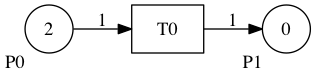
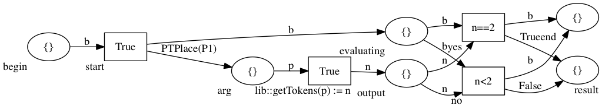
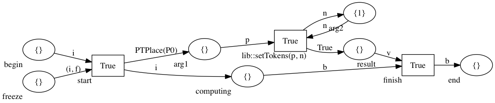
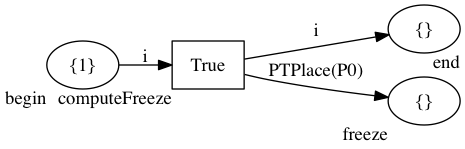
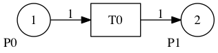

# PyRPN

PyRPN is an *extensible python library* that provides all the necessary to define
and execute **Reflective Petri Nets** (RPNs).
It provides to researchers the ability to quickly prototype RPNs and/or build frameworks/tools
that make use of such a modeling formalism.


## How do I get setup?

To install PyRPN you can use:
```
pip3 install pyrpn
```
this will download and install the latest release from the [Python Package Index](https://pypi.python.org/pypi).

To install PyRPN from sources, first download the latest version from this repository.
You can either clone the repository or download and uncompress the .zip archive.
Then run:
```
python3 setup.py install
```

PyRPN should work fine with any Python 3.x version.

## First steps with PyRPN

Let's define a simple RPN and see how it works in practice.
First, we define a simple Place/Transition (P/T) net that represents the **base-level**.

Code snippets reported in the following can be executed as script or in a interactive Python shell.

```python
from rpn import *
from snakes.nets import Variable, Value, Expression, MultiSet

base = BaseNet()
base.add_place('P0', 2)
base.add_place('P1')
base.add_transition('T0')
base.add_input_arc('T0', 'P0')
base.add_output_arc('T0', 'P1')
base.draw(dot_file='examples/base-example.dot', render=True)
```
The `draw` method produces an image of the `base` net as shown below.



Once the base level has been defined we can easily create a RPN structure.

```python
rpn = RPN('simple-example', base)
```

Then, we can start creating **freeze**, **guard** and **strategy** **meta-level** nets.
Let's start by defining a simple example of guard.

```python
guard = GuardNet('guard-example', rpn.get_reification())

tr_name = 'lib::getTokens(p) := n'
guard.add_place('evaluating')
guard.add_place('arg')
guard.add_place('output')
guard.add_transition('start')
guard.add_transition('yes', Expression('n==2'))
guard.add_transition('no', Expression('n<2'))
guard.add_transition(tr_name)
guard.add_input_arc('begin', 'start', Variable('b'))
guard.add_output_arc('evaluating', 'start', Variable('b'))
guard.add_output_arc('arg', 'start', Value(PTPlace('P1')))
guard.add_input_arc('arg', tr_name, Variable('p'))
guard.add_output_arc('output', tr_name, Variable('n'))
guard.add_input_arc('output', 'yes', Variable('n'))
guard.add_input_arc('output', 'no', Variable('n'))
guard.add_input_arc('evaluating', 'yes', Variable('b'))
guard.add_input_arc('evaluating', 'no', Variable('b'))
guard.add_output_arc('end', 'yes', Variable('b'))
guard.add_output_arc('result', 'yes', Value(True))
guard.add_output_arc('end', 'no', Variable('b'))
guard.add_output_arc('result', 'no', Value(False))

guard.draw(dot_file='examples/guard-example.dot', render=True)
guard.dump(pnml_file='examples/guard-example.pnml')
```



The above guard net basically evaluates `True` in the `result` place
whenever the place `P1` of the base level contains `2` tokens.
It makes use of the *library function* `lib::getTokens(p) := n`, that,
given as input a `PTPlace` contained in the Variable `p`,
it returns the marking of that place in the Variable `n`.

Now, let's define also a *strategy* net which simply put `1` token into the place `P0` of the base level.
Since this model has been already created, we simply load it from its *pnml* representation.

```python
strategy = StrategyNet('strategy-example', rpn.get_reification(), pnml='examples/strategy-example.pnml')
strategy.draw(dot_file='examples/strategy-example.dot', render=True)
```



Since the strategy works only upon the place `P0`, we define a proper *freeze* net that blocks only
this element.

```python
freeze = FreezeNet('freeze-example', rpn.get_reification(), pnml='examples/freeze-example.pnml')
freeze.draw(dot_file='examples/freeze-example.dot', render=True)
```



Once all these nets has been created we can compose them in the RPN structure and then execute the base level.
At each firing transition of the base level all the guards are evaluated to potentially launch the associated strategies.

```python
rpn.add_mapping(guard, freeze, strategy)

transition = rpn.enabled_pt_transitions()[0]
assert transition == PTTransition('T0')
active_strategies = rpn.fire_pt(transition) # P1 contains 1 tokens
assert len(active_strategies) == 0
transition = rpn.enabled_pt_transitions()[0]
assert transition == PTTransition('T0')
active_strategies = rpn.fire_pt(transition) # now P1 contains 2 tokens
assert len(active_strategies) == 1
strategy = active_strategies.get('strategy-example')
```

Now the active strategy can be executed either step-by-step or as a single transaction.
In the following we adopt the latter option by using the method `execute`.

```python
strategy.execute()
rpn.finalize_strategy(strategy, strategy.finalizable_flows()[0]) # the effects are applied into the base level
assert rpn.get_pt_marking() == MultiSet([PTPlace('P0')] + [PTPlace('P1')] * 2)
rpn.get_baseNet().draw(dot_file='examples/base_mod-example.dot', render=True)
```



## Licence

See the [LICENSE](LICENSE.txt) file for license rights and limitations (GNU GPL-3.0+).

## Who do I talk to?

* Matteo Camilli: matteo.camilli@unimi.it
* Lorenzo Capra: lorenzo.capra@unimi.it
* Walter Cazzola: walter.cazzola@unimi.it
